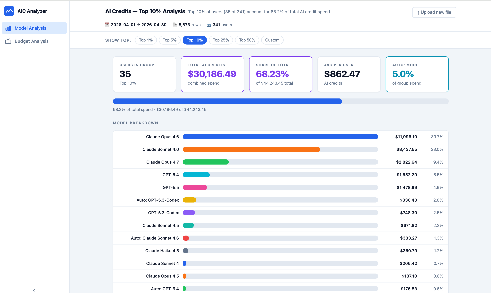
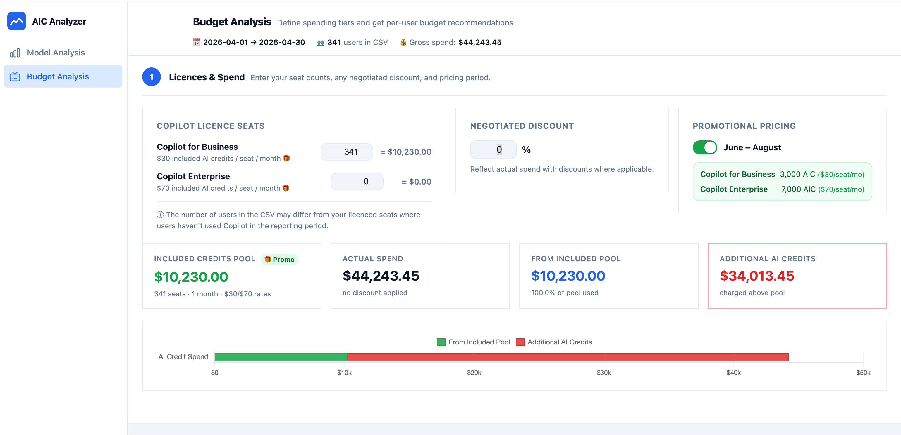
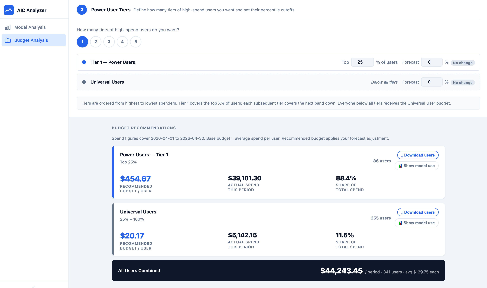

# AIC Analyzer

A browser-based tool for making sense of your GitHub Copilot AI credit spend. Drop in your Copilot Usage Data CSV, instantly see who's spending what and on which models, then get data-driven per-user budget recommendations — no installation, no sign-in, no data leaves your machine.

**[→ Open the app](https://colinbeales.github.io/AIC-Analyzer/)**

Pricing is estimated based on pricing from 19 May 2026.

---

## What it does

### Model Analysis

Upload your Copilot billing export and immediately see a breakdown of AI credit spend across your organisation. Use the percentile selector to focus on any slice of your user base — for example, "show me just the top 10% of spenders" — and the view updates instantly to show:

- **How many users** fall into that group and what share of total spend they represent
- **Total AI credits** consumed by the group and the average per user
- **Auto: mode usage** — the proportion of spend driven by Copilot's automatic model selection
- **Model breakdown** — a ranked bar chart showing which AI models are being used and what each costs, with request counts on hover
- **Model overrides** — Allows forecasting future spend if users start to adopt alternative models, such more cost concious model choices made by developers or via GitHub Copilot Auto Mode selecting a more appropriate model for a given task. (**note:** Auto Mode's 10% discount is not reflected in these figures)

This makes it easy to spot model patterns of usage across small or large sets of Copilot users to spot if particular model trends are driving your bill and how more appropriate model use could help optimise costs.

---

### Budget Analysis — Step 1: Licences & Spend

Before setting per-user budgets you need to understand the relationship between your licence pool and your actual spend. Enter your seat counts for Copilot for Business and Copilot Enterprise, and the tool calculates:

- **Included Credits Pool** — the total AI credits covered by your licences each month
- **Actual Spend** — what your organisation consumed in the reporting period
- **From Included Pool** — how much of that spend was absorbed by included credits
- **Additional AI Credits** — any overage charged above the pool, highlighted in red

A toggle lets you switch between standard and promotional pricing (June–August), and if you have a negotiated discount you can enter the percentage to reflect your true net spend throughout.

---

### Budget Analysis — Step 2: Power User Tiers & Recommendations

Not all users need the same budget. This step lets you define up to five spending tiers — for example a "Power Users" tier covering the top 25% of spenders, with everyone else falling into the "Universal Users" band.

For each tier you can set a **forecast adjustment** (positive for expected growth, negative if you're optimising). The tool then produces per-user budget recommendations:

- **Recommended Budget / User** — the figure to enter in GitHub's budget settings, based on average spend in that tier plus your forecast
- **Actual Budget** (shown separately when a negotiated discount is in place) — what you'll actually be charged after the discount is applied. GitHub's tooling doesn't account for negotiated rates, so both figures are shown side by side
- **Download users** — export the full ranked user list for any tier as a CSV
- **Show model use** — open a breakdown of model usage scoped to just the users in that tier, so you can see what's driving spend in each band

An **All Users Combined** total at the bottom gives you the aggregate budget figure across all tiers.

---

## Getting started

### Step 1 — Download your usage report from GitHub

> **Who can do this:** Enterprise owners, organisation owners, and billing managers.

GitHub generates the billing CSV asynchronously and emails it to you as an admin. To request it:

1. Go to your **enterprise home page**, **billing overview**, or **premium request analytics page** on GitHub.com
2. Click **Preview your usage** in the announcement banner
3. In the dialog that appears, click to **request a detailed usage report**
4. GitHub will email the CSV to you once it's ready (usually within a few minutes)

Alternatively you can request the report directly from the **premium request analytics page** or via the GitHub API.

The report contains one row per user, per model, per day and includes the two columns this tool uses:

| Column | Description |
|---|---|
| `aic_gross_amount` | Estimated cost in USD under usage-based billing |
| `aic_quantity` | Number of AI credits consumed |

For full details see the [GitHub documentation on downloading the usage report](https://docs.github.com/en/copilot/how-tos/manage-and-track-spending/prepare-for-usage-based-billing#download-the-usage-report).

---

### Step 2 — Open the tool and upload your CSV

#### From GitHub

**[→ Open the app](hhttps://colinbeales.github.io/AIC-Analyzer/)**

#### Local

1. Open `index.html` in your browser
2. Drag and drop (or click to browse) your CSV onto the upload area
3. Switch between **Model Analysis** and **Budget Analysis** in the left sidebar

Everything runs locally in the browser — your billing data is never uploaded anywhere.